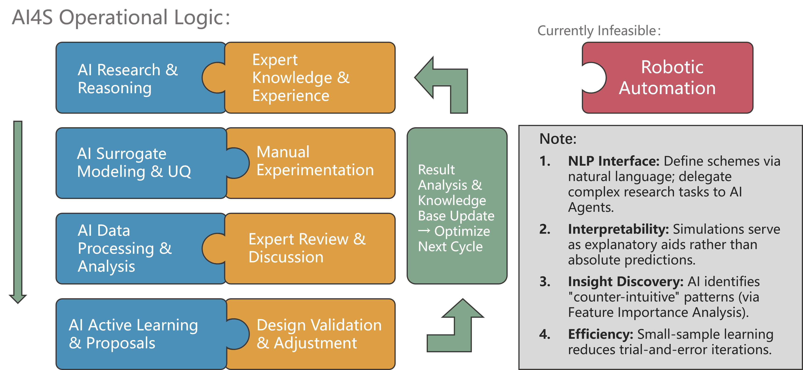

# **Science Copilot Loop (Centaur-AI4S)**

<div align="center">

  <a href="./README.md">
    
  </a>
  <a href="./README_CN.md">
    
  </a>

</div>


一套利用机器学习预测，小样本数据学习，结合人类判断，加速科学发现的闭环工作流。



## 📖 项目简介 (Introduction)

**Science-Copilot-Loop** 是一个专为科学发现（AI4S）设计的"人机协同"（Human-in-the-loop）实操框架。

不同于追求完全自动化的"无人实验室"愿景，本项目立足于当下的技术现实，主张 **AI 算法与人类专家** 像拼图一样紧密咬合：

* **AI (蓝色拼图)**：负责高维数据压缩、广义文献调研、概率空间搜索（主动学习）。  
* **Human (黄色拼图)**：负责物理直觉判断、非结构化异常捕捉、实验伦理与安全边界把控。

这是一个不断迭代的**螺旋上升闭环**，旨在通过统计学和机器学习预测来减少对传统模拟计算的依赖，以及小样本主动学习来降低科研试错成本。

## 🧩 核心架构 (Core Workflow)

本框架将科研过程拆解为四个核心阶段，强调 AI 与人类专家的交互与互补：

| 阶段 (Phase) | 🤖 AI Role (系统/算法) | 🧑‍🔬 Human Role (专家/实验) |
| :---- | :---- | :---- |
| **Phase 1: 调研与推理** | **Agent Reasoning** 利用 LLM Agent 进行文献挖掘与逻辑推理，生成初步方案。 | **Expert Knowledge** 提供领域知识、设定物理约束与初始假设。 |
| **Phase 2: 仿真与设计** | **Surrogate Modeling & UQ** 统计性机器学习预测，并提供不确定性量化评估。 | **Manual Experimentation** 执行具体的湿实验（Wet-lab），记录物理现象。 |
| **Phase 3: 数据与审阅** | **Data Processing** 清洗多模态数据，进行特征提取与降维分析。 | **Review & Discussion** 审阅分析结果，捕捉“反常识”的异常点。 |
| **Phase 4: 迭代与决策** | **Active Learning** 基于贝叶斯优化推荐下一组实验参数。 | **Validation & Adjustment** 审查 AI 建议的可行性，调整最终实验队列。 |
---
---
##  📂 操作记录 


**项目一：用现有的锂电充放电原始数据为素材，训练模型通过前期数据预测长期性能**

1.数据来源：**Data-driven prediction of battery cycle life before capacity degradation**  
Severson et al., Nature Energy, 2019

  **源文件组成：**
  | 项目 | 数值 |
|------|------|
| 文件数 | 140 个 JSON（140个电池的数据） |
| 总大小 | 26.03 GB |
| 平均每文件 | 190 MB |
| 最小 | 0.35 MB |
| 最大 | 549 MB |


2.先完整加载最小的文件分析组成，发现作者提供的beep结构实际上相当于把常见的循环原始数据（巨大的表格）转成了标准化结构化嵌套结构的JSON文档，虽然数据量一样，但这种结构程序读取更快，更方便维护。不过操作的时候还是当做自己在处理充放电数据更直观。\
每个 JSON 文件代表一颗电池的完整生命周期，举例结构如下：

```json
{
  "@module": "beep.structure",
  "@class": "ProcessedCyclerRun",
  "barcode": "电池序列号",
  "protocol": "充电策略名称",
  "channel_id": 25,
  "summary": { ... },              // 循环级汇总数据
  "cycles_interpolated": { ... }  // 详细时序数据
}
```
3.为了确认理解正确，试着按这个思路提取一组循环数据，画出充放电曲线和dq/dv,结果完全正常，证明此步无误。


4.数据筛选

**筛选条件**：循环数 ≥ 100

**原因**：需要第10和第100循环来计算 ΔQ 特征

**结果**：140 → 约 120 颗电池
```
cycle 0: Q = 1.93 Ah  ← 异常高
cycle 1: Q = 1.04 Ah
cycle 2: Q = 1.05 Ah  ← 稳定
```

第0/1循环是"形成循环"（formation cycle），容量异常高，不能作为参考。

5.数据划分
```python
X_train, X_test = train_test_split(X, y, test_size=0.2, random_state=42)
```

| 集合 | 比例 | 数量 | 用途 |
|------|------|------|------|
| 训练集 | 80% | ~96 | 模型训练 + 交叉验证 |
| 测试集 | 20% | ~24 | 最终评估 |

6.特征工程

ΔQ(V) 差分容量曲线
**定义**：
```
ΔQ(V) = Q₁₀₀(V) - Q₁₀(V)
```
**计算步骤**：

```python
def compute_delta_Q(data, cycle_a=10, cycle_b=100, n_points=1000):
    # 1. 提取两个循环的数据
    data_a = get_cycle_data(data, cycle_a)
    data_b = get_cycle_data(data, cycle_b)
    
    # 2. 只取放电部分
    V_a, Q_a = get_discharge_QV(data_a)
    V_b, Q_b = get_discharge_QV(data_b)
    
    # 3. 确定共同电压范围
    V_min = max(V_a.min(), V_b.min())
    V_max = min(V_a.max(), V_b.max())
    
    # 4. 统一电压网格
    V_grid = np.linspace(V_min, V_max, n_points)
    
    # 5. 插值到统一网格
    Q_a_interp = np.interp(V_grid, V_a, Q_a)
    Q_b_interp = np.interp(V_grid, V_b, Q_b)
    
    # 6. 计算差分
    delta_Q = Q_b_interp - Q_a_interp
    
    return V_grid, delta_Q
```

--

从 ΔQ 曲线提取 9 个统计量：

| 特征 | 公式 | 物理意义 |
|------|------|----------|
| `dQ_variance` | `np.var(ΔQ)` | 容量变化的不均匀性 |
| `dQ_minimum` | `np.min(ΔQ)` | 最大局部退化 |
| `dQ_maximum` | `np.max(ΔQ)` | 最大局部增益 |
| `dQ_mean` | `np.mean(ΔQ)` | 平均容量变化 |
| `dQ_skewness` | `scipy.stats.skew(ΔQ)` | 退化模式对称性 |
| `dQ_kurtosis` | `scipy.stats.kurtosis(ΔQ)` | 退化模式尖锐程度 |
| `dQ_range` | `max - min` | 变化幅度 |
| `dQ_abs_mean` | `np.mean(|ΔQ|)` | 绝对变化量 |
| `dQ_std` | `np.std(ΔQ)` | 变化标准差 |


--

从 `summary` 提取第100循环的额外信息：

| 特征 | 来源 | 描述 |
|------|------|------|
| `temp_max` | `temperature_maximum[99]` | 最高温度 |
| `temp_avg` | `temperature_average[99]` | 平均温度 |
| `resistance` | `dc_internal_resistance[99]` | 内阻 |
| `charge_time` | `charge_duration[99]` | 充电时长 |
| `capacity_fade_100` | `Q[0] - Q[99]` | 前100循环容量衰减 |
| `capacity_ratio_100_2` | `Q[99] / Q[1]` | 容量保持率 |

**最终特征数**：15 个

7.用 Elastic Net 回归训练模型

7.1目标变量变换

```python
y_log = np.log(cycle_life)
```

**原因**：寿命范围大（150-2300），取对数使分布更均匀，回归更稳定

7.2特征标准化

```python
scaler = StandardScaler()
X_scaled = scaler.fit_transform(X)
```

**原因**：不同特征量纲不同，标准化让正则化公平作用于所有特征

7.3超参数搜索

使用 5 折交叉验证的网格搜索：

```python
param_grid = {
    'alpha': [0.001, 0.01, 0.1, 1.0],      # 正则化强度
    'l1_ratio': [0.1, 0.3, 0.5, 0.7, 0.9], # L1比例 (0=Ridge, 1=Lasso)
}

grid_search = GridSearchCV(
    ElasticNet(max_iter=10000),
    param_grid,
    cv=5,
    scoring='neg_mean_absolute_percentage_error'
)
```

**最优参数**：
```
alpha = 0.1
l1_ratio = 0.3
```

l1_ratio=0.3 偏向 Ridge，说明保留更多特征比稀疏更好

8.训练结果

**测试集性能**：

| 指标 | 值 | 含义 |
|------|-----|------|
| **MAPE** | 15.15% | 平均百分比误差 |
| **RMSE** | 154.9 cycles | 均方根误差 |
| **R²** | 0.70 | 解释方差比例 |

**特征重要性**（系数绝对值排序）：

| 排名 | 特征 | 系数 |
|------|------|------|
| 1 | capacity_fade_100 | -0.097 |
| 2 | dQ_minimum | +0.077 |
| 3 | dQ_std | -0.073 |
| 4 | dQ_mean | +0.072 |
| 5 | dQ_abs_mean | -0.069 |

完整模型结果: 
```
log(寿命) = 6.491553
          - 0.097189 × capacity_fade_100_scaled
          + 0.077163 × dQ_minimum_scaled
          - 0.073411 × dQ_std_scaled
          + 0.071857 × dQ_mean_scaled
          - 0.068692 × dQ_abs_mean_scaled
          - 0.039759 × dQ_range_scaled
          - 0.025998 × resistance_scaled
          + 0.012878 × dQ_maximum_scaled
```


9.不确定性量化

#### 方法1：Gaussian Process (GP)

- 贝叶斯方法，天然给出预测分布
- 使用 Matern 核 + 噪声项
- 适合小数据集

| 指标 | 值 |
|------|-----|
| MAPE | 2.3% |
| 95% Coverage | 92.9% |
| 区间宽度 | ±6.2% |
| 校准误差 | 2.1% |

| 真实值 | 预测值 | 95% CI | 在区间内 |
|--------|--------|--------|----------|
| 878 | 850 | [594, 1216] | ✅ |
| 1164 | 1665 | [930, 2983] | ✅ |
| 737 | 939 | [651, 1353] | ✅ |

（未优化模型，CI 略大）

10.原文未强调的发现

10.1capacity_fade_100（前100循环容量衰减）是最重要特征，这实际上是模型自发形成的结论，与现实世界的工程师的经验很大程度符合

10.2预测时十分异常的样品:

| 真实值  | 预测值  | 误差         |
| ---- | ---- | ---------- |
| 878  | 775  | 11.7% ✅    |
| 1164 | 1256 | 7.9% ✅     |
| 1518 | 1271 | 16.3%      |
| 942  | 912  | 3.1% ✅     |
| 538  | 1185 | 120% ❌ 异常点 |

有一颗电池在“体检”时表现得非常健康，容量衰减慢，$\Delta Q$ 曲线也很稳定。所以模型根据前100圈的数据，自信地判断它能活到 1185 圈。实际情况却是它可能在第 200 或 300 圈时，内部突然发生了锂金属析出或者微短路或者其他负面情况，导致病情急转直下，在 538 圈就挂了。这种异常样品或许潜藏着某种人们暂未注意到的规律，有深入测试挖掘的价值

---


