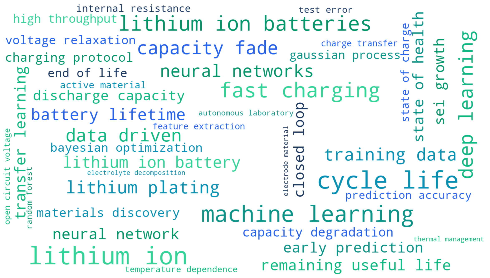
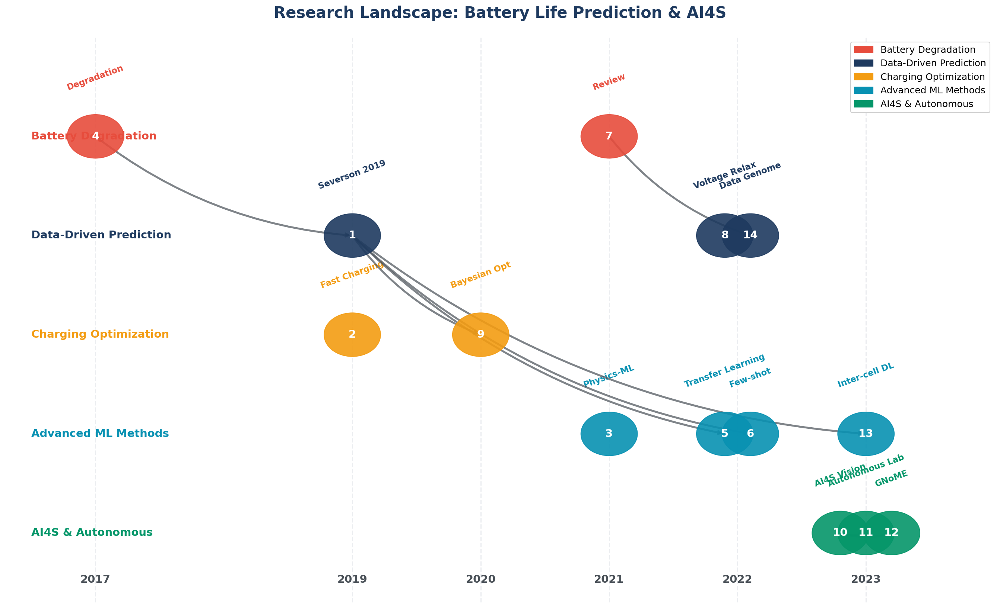
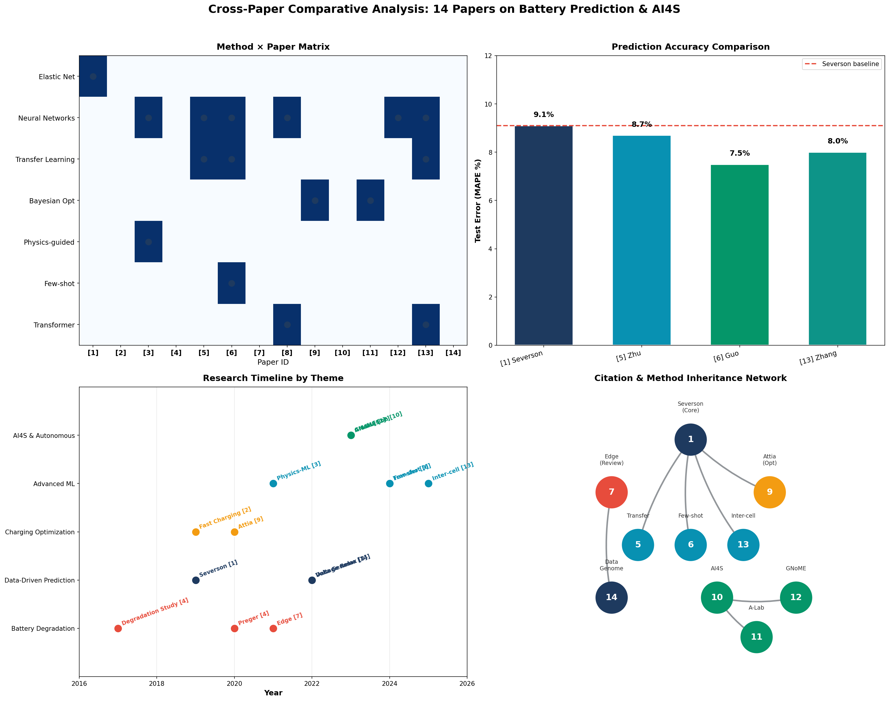

# Phase 1: Multi-Paper Literature Analysis
## Battery Life Prediction & AI for Science

| Papers Analyzed | Research Themes | Publication Span |
|:---------------:|:---------------:|:----------------:|
| **14** | **5** | **2019–2025** |

---

## 1. Background

在人工智能驱动的科学研究领域，文献综述是研究工作的基础环节，但传统的人工阅读方式面临显著的**效率瓶颈**。一篇典型的学术论文包含大量背景介绍、方法细节和引用文献，而研究者真正需要提取的核心信息——关键方法、主要发现、技术创新点——往往分散在长篇幅的文本之中。

这种**"信噪比"问题**在跨论文分析时尤为突出：当需要系统性地比较多篇论文的方法演进、识别研究空白、梳理引用脉络时，人工阅读的时间成本呈指数级增长。

> **Pipeline Overview**
> 
> PDF Documents → Text Extraction → Structured Summarization → Cross-Paper Analysis → Visualization

本分析采用上述自动化流程，能够在**数分钟内**完成对十余篇论文的系统性分析，为后续建模工作提供坚实的文献基础。

---

## 2. Paper Corpus

本次分析涵盖了电池寿命预测与人工智能科学研究领域的**十四篇代表性论文**，发表于 2019–2025 年间，来源包括 Nature、Nature Energy、Nature Communications、Joule、PNAS 等顶级期刊。

| # | Title | Authors | Year | Venue |
|---|-------|---------|------|-------|
| 1 | Data-driven prediction of battery cycle life before capacity degradation | Severson et al. | 2019 | Nature Energy |
| 2 | Fast charging of energy-dense lithium-ion batteries | Wang et al. | 2022 | Nature |
| 3 | Learning dynamical systems from data: Physics-guided deep learning | Yu & Wang | 2024 | PNAS |
| 4 | Degradation of Commercial Lithium-Ion Cells | Preger et al. | 2020 | J. Electrochem. Soc. |
| 5 | Rapid Test and Assessment Based on Transfer Learning | Zhu et al. | 2024 | IEEE Trans. |
| 6 | Semi-supervised learning for few-shot battery lifetime prediction | Guo et al. | 2024 | Joule |
| 7 | Lithium ion battery degradation: what you need to know | Edge et al. | 2021 | PCCP |
| 8 | Data-driven capacity estimation from voltage relaxation | Zhu et al. | 2022 | Nature Comm. |
| 9 | Closed-loop optimization of fast-charging protocols | Attia et al. | 2020 | Nature |
| 10 | Scientific discovery in the age of artificial intelligence | Wang et al. | 2023 | Nature |
| 11 | An autonomous laboratory for accelerated synthesis | Szymanski et al. | 2023 | Nature |
| 12 | Scaling deep learning for materials discovery | Merchant et al. | 2023 | Nature |
| 13 | Battery lifetime prediction with inter-cell deep learning | Zhang et al. | 2025 | Nature MI |
| 14 | Principles of the Battery Data Genome | Ward et al. | 2022 | Joule |

---

## 3. Processing Pipeline

文献处理流程分为**三个阶段**：

### 3.1 Text Extraction

使用 `PyMuPDF` 库从原始文档中提取全文内容，每篇论文被转换为独立的 Markdown 文件以便后续处理。

### 3.2 Structured Summarization

利用 **Gemini 2.0 Flash** 大语言模型对每篇论文进行分析，提取以下结构化字段：

- **基本信息**：标题、作者、年份、期刊
- **研究内容**：研究问题、方法论、主要贡献
- **结果评估**：核心结果、局限性、与电池预测的关联

完整的结构化摘要请参阅 📄 **[Structured Summaries](structured_summaries.md)**

### 3.3 Cross-Paper Analysis

基于结构化摘要进行多维度对比分析：

| 维度 | 分析内容 |
|------|----------|
| 方法对比 | 机器学习方法与物理模型的分布与演进 |
| 数据集对比 | 规模、电池类型、公开性 |
| 性能指标 | 预测精度、效率提升 |
| 研究脉络 | 引用关系、方法传承 |

详细的跨论文对比分析请参阅 📄 **[Cross-Paper Analysis](cross_paper_analysis.md)**

---

## 4. Visualizations

### 4.1 Keyword Phrase Cloud

基于全部论文文本生成的专业词组词云，词组大小由**出现频率**与**领域相关性**加权决定。核心术语包括：

- **电池相关**：lithium ion, cycle life, capacity fade, fast charging
- **方法相关**：machine learning, deep learning, transfer learning
- **预测相关**：remaining useful life, state of health



### 4.2 Research Landscape

研究脉络图按**时间轴**和**主题分类**展示了十四篇论文的分布关系，划分为五个主题：

| 主题 | 论文 |
|------|------|
| Battery Degradation | [4] [7] |
| Data-Driven Prediction | [1] [8] [14] |
| Charging Optimization | [2] [9] |
| Advanced ML Methods | [3] [5] [6] [13] |
| AI4S & Autonomous | [10] [11] [12] |

图中箭头表示论文间的**方法传承关系**，清晰呈现了从 Severson 2019 基础工作向迁移学习、小样本学习方向的演进脉络。



### 4.3 Cross-Paper Comparison

综合对比可视化包含**四个子图**：

| 位置 | 内容 |
|------|------|
| 左上 | 方法 × 论文关联矩阵 |
| 右上 | 预测精度对比柱状图 |
| 左下 | 时间线演进图 |
| 右下 | 引用关系网络图 |



---

## 5. Key Findings

### 5.1 Consensus Conclusions

通过对十四篇论文的系统性分析，归纳出以下**共识性结论**：

- **早期预测可行**：利用前 100 个循环的数据即可实现对电池全生命周期的有效预测，部分方法仅需前 5 个循环即可完成分类任务
- **电压特征有效**：充放电曲线差异所构成的特征向量在多个模型中表现出色
- **迁移学习价值**：跨电池类型、跨实验条件的知识迁移能够显著降低对标注数据的需求

### 5.2 Method Evolution

在方法演进方面，可以观察到清晰的发展脉络：

| 阶段 | 主流方法 | 代表论文 |
|------|----------|----------|
| 2019 | Linear Models (Elastic Net) | [1] Severson |
| 2020 | Bayesian Optimization | [9] Attia |
| 2022–24 | Deep Learning + Transfer | [5] [6] [8] [13] |
| Frontier | Physics-guided DL | [3] Yu & Wang |

### 5.3 Open Questions

> ⚠️ **待解决的开放问题**
> - 模型在新电池化学体系上的**泛化性**
> - 机器学习模型的**可解释性**
> - 不确定性量化的**可靠性**
> - 从离线研究到 BMS **实时部署**

---

## 6. File Structure

```
phase1-research/multi-paper-analysis/
├── README.md
├── extracted/
│   ├── 1_Data-driven prediction...md
│   ├── 2_Fast charging...md
│   └── ... (14 files)
├── figures/
│   ├── phrase_cloud.png
│   ├── research_landscape.png
│   └── cross_paper_visual.png
├── structured_summaries.json
├── structured_summaries.md
└── cross_paper_analysis.md
```

---

## 7. Next Steps

TBD

---

*Generated: 2026-02-06*
