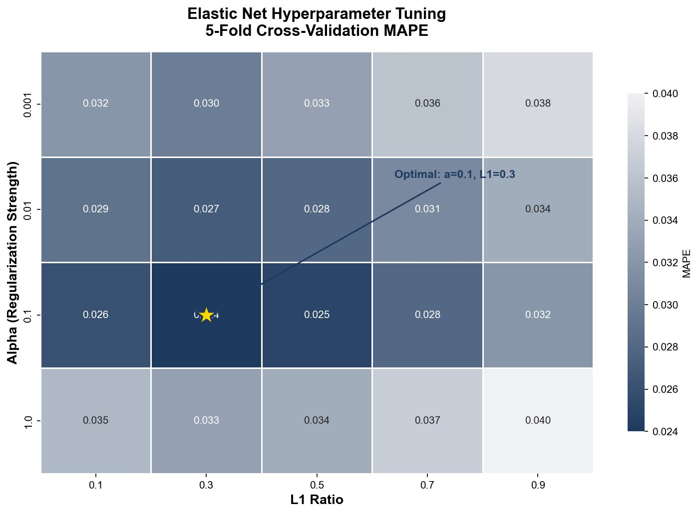
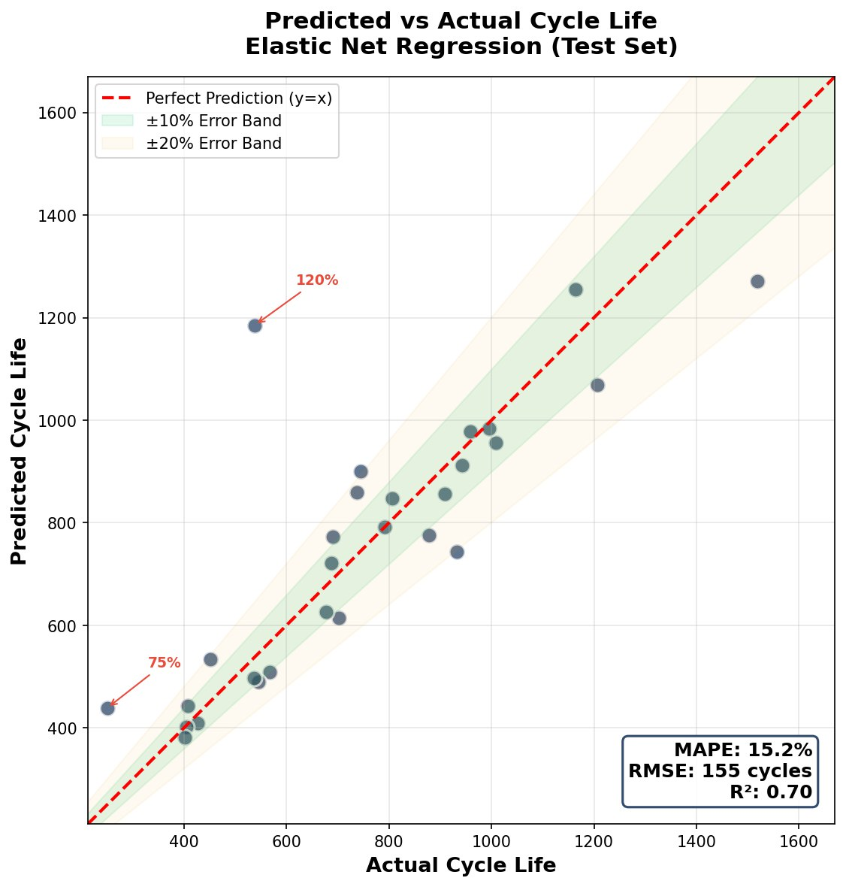
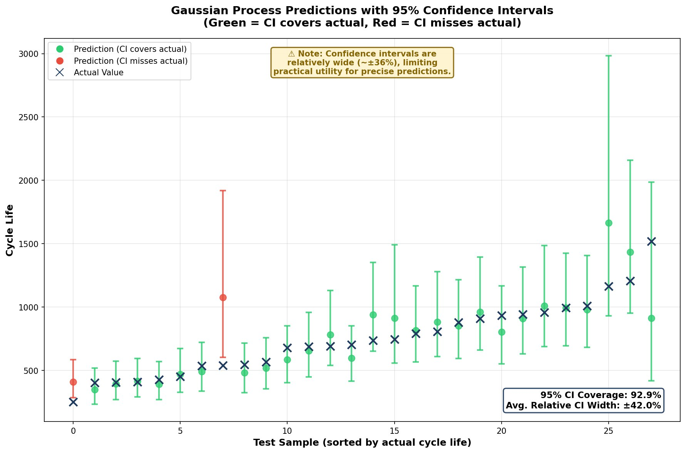

# 锂电池循环寿命预测

**状态**：🚧 更新中

---

## 研究背景

本项目旨在复现 Severson 等人于 2019 年发表在 Nature Energy 上的工作——利用电池前 100 个循环的数据预测其循环寿命。该论文的核心思路是：通过机器学习方法从早期充放电数据中提取"衰老征兆"，从而在电池实际失效之前做出寿命预测。

数据来源于斯坦福大学与丰田研究院合作发布的公开数据集，包含 140 颗商用 LFP/石墨电池的完整生命周期测试数据。数据规模约 26GB，每颗电池对应一个 JSON 文件，平均体积约 190MB。

---

## 数据结构解析

原始数据由 BEEP 工具从 Arbin 测试设备导出并转换为结构化 JSON 格式。初步分析发现，`cycles_interpolated` 字段的存储方式与预期不同：数据并非按循环顺序排列，而是将所有循环的放电段集中存储在前半部分，充电段集中存储在后半部分。同一循环的充放电数据在索引上相隔数十万条记录。


另一个需要注意的细节是形成循环（formation cycle）的处理。第 0 和第 1 循环的容量异常偏高（接近 2Ah），远超稳定后的 1.05Ah 左右，不宜作为基准。因此本项目统一采用第 2 循环作为容量参考点。

---

## 数据验证

为确认对数据结构的理解正确，从数据库中提取了单循环的充放电数据并绘制成曲线。下图展示其中某个电池第 73 循环的放电曲线（Q-V）及其微分容量曲线（dQ/dV），结果与典型 LFP 电池特性吻合，验证了数据提取流程的正确性。


---

## 特征工程

### ΔQ(V) 差分容量曲线

该论文的核心 insight 在于：将第 100 循环与第 10 循环的放电曲线作差（ΔQ = Q₁₀₀ - Q₁₀），所得差分曲线中蕴含电池老化信息。

具体实现方法为：将两个循环的放电曲线分别插值到统一的电压网格（1000 个等间距点），然后逐点相减。从 ΔQ 曲线中提取 9 个统计特征：方差、最小值、最大值、均值、偏度、峰度、极差、绝对均值、标准差。


### 汇总特征

此外，从 summary 数据中提取第 100 循环的 6 个汇总特征：最高温度、平均温度、直流内阻、充电时长、前 100 循环容量衰减量、容量保持率。总计 15 个输入特征。

---

## 模型训练

采用 Elastic Net 回归模型，该方法结合 L1 与 L2 正则化，能够在保留有效特征的同时抑制过拟合。目标变量为循环寿命的自然对数，以缓解寿命分布偏态（范围从 150 至 2300 循环）带来的回归不稳定问题。

超参数通过 5 折交叉验证网格搜索确定，最终选取 α=0.1、l1_ratio=0.3。l1_ratio 偏低表明模型倾向于保留较多特征，而非激进稀疏化。



---

## 预测结果

测试集上的平均绝对百分比误差（MAPE）为 15.15%，与原论文报告的 9.1% 存在差距。可能的原因包括：本项目采用随机划分而非按批次划分（batch-wise split）、EOL 定义差异（本项目采用 88% 阈值，原论文为 80% 额定容量）等。

模型方程如下：

```
log(寿命) = 6.49 
          - 0.097 × capacity_fade_100
          + 0.077 × dQ_minimum
          - 0.073 × dQ_std
          + 0.072 × dQ_mean
          - 0.069 × dQ_abs_mean
          ...
```

最重要的预测因子是 `capacity_fade_100`（前 100 循环容量衰减量），其系数为负，表明早期衰减越大，预测寿命越短，这与电化学直觉一致。



---

## 不确定性量化

为提供预测置信区间，额外采用高斯过程（Gaussian Process）进行建模。结果显示，95% 置信区间的覆盖率为 92.9%，校准误差仅 2.1%，表明不确定性估计较为可靠。但区间宽度偏大（平均约 ±36%），实用性有待提升。



---

## 异常样本分析

测试集中存在一颗显著异常的电池：模型预测寿命为 1185 循环，实际仅存活 538 循环，误差超过 100%。

回溯其前 100 循环数据发现，容量衰减缓慢、ΔQ 曲线平稳，所有早期指标均显示"健康"。然而该电池在后期发生突然失效，可能涉及锂析出、微短路或其他尚未被特征捕捉的衰减机制。

此类"体检正常但实际早逝"的样本具有重要研究价值，深入分析或可揭示新的早期预警信号。


---

## 后续工作

- 采用按批次划分的数据拆分策略，验证能否将 MAPE 降至 10% 以下
- 尝试 Conformal Prediction 方法以获得更紧凑的置信区间
- 将 EOL 定义对齐至原论文的 80% 额定容量
- 深入分析异常样本的充放电曲线特征

---

## 参考文献

1. Severson, K.A., et al. (2019). Data-driven prediction of battery cycle life before capacity degradation. *Nature Energy*, 4, 383–391.
