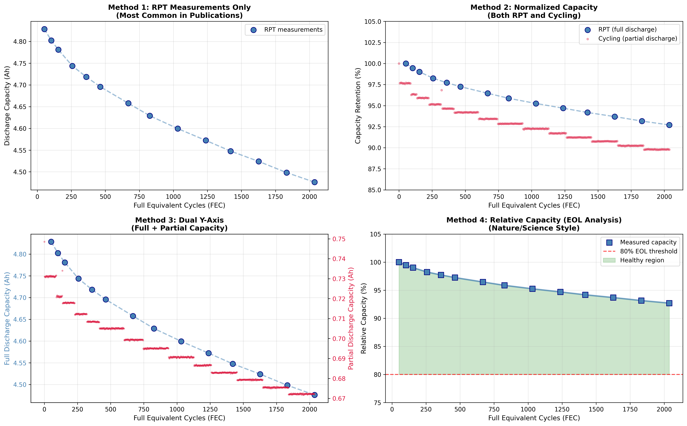
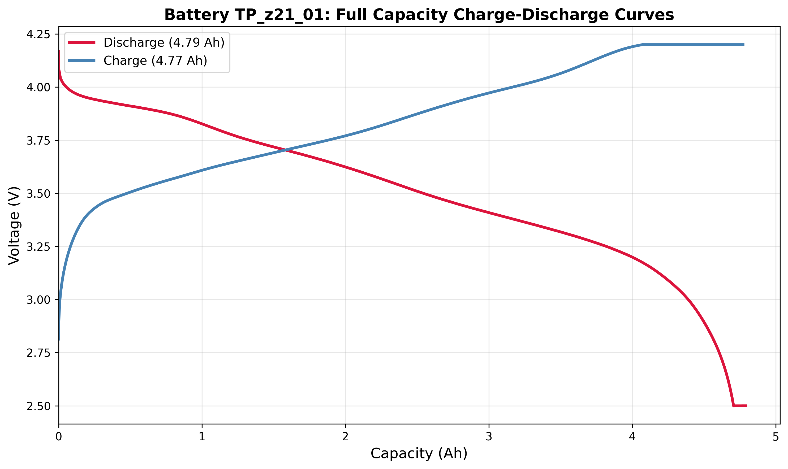
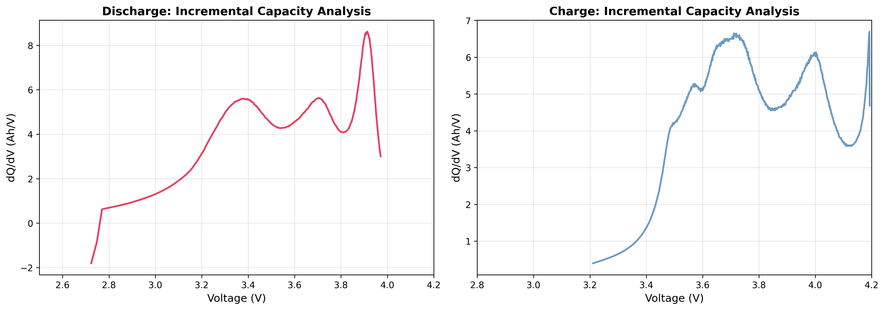

# 2.1.2 Multi-Stage 数据集：系统化条件组合的寿命预测

**状态**：🚧 数据准备中

---

## 📊 数据集信息

**来源**：*A Comprehensive Multi-Stage Lithium-Ion Battery Aging Dataset*  
**作者**：Kim et al.  
**期刊**：Nature Scientific Data, 2024  
**DOI**：[10.1038/s41597-024-03859-z](https://doi.org/10.1038/s41597-024-03859-z)  
**Figshare**：[10.6084/m9.figshare.25975315](https://doi.org/10.6084/m9.figshare.25975315)

---

## 📦 数据集拆解

### 示例电池：TP_z21_01

为验证数据完整性并理解数据结构，从循环老化数据集中随机选取一颗电池（TP_z21_01）进行深入分析。

**测试条件**：
- 环境温度：45°C
- 测试点：z21（循环老化 - 测试点 21）
- 电池编号：01

**测试结果概览**：
- 总循环数：2,037 圈（FEC）
- 实际记录：15,552 个循环数据点
- 初始容量：4.828 Ah
- 最终容量：4.476 Ah
- 容量保持率：92.7%
- 容量检查次数：14 次

### 容量衰减曲线

电池在整个生命周期中经历了两种类型的测试：**日常循环**（ZYK 文件）和**定期检查**（CU/exCU 文件）。这两种数据的区别在于：

- **日常循环**：部分充放电（DOD < 100%），模拟实际使用场景，连续运行无休息
- **定期检查**：完整充放电（DOD = 100%），标准化测试（C/20，23°C），测试前有休息恢复期

下图展示了学术界对这种测试策略的常用绘图方法。其中 **Method 3（双Y轴）** 同时展示了两种数据：蓝点表示 RPT 检查点的完整容量（~4.8 Ah），红点表示日常循环的部分容量（~0.7 Ah）。可以观察到蓝点始终略高于红点，这是因为 RPT 前有休息恢复期，消除了浓差极化，而日常循环是连续运行，存在累积疲劳效应。



**关键观察**：
1. RPT 检查点（蓝色）提供标准化的容量基准，用于准确评估电池健康状态
2. 循环数据（红色）反映实际使用中的表现，容量略低是正常现象
3. 两种数据的归一化衰减趋势一致，验证了数据的内部一致性
4. Method 4 展示了相对容量随循环数的变化，是顶刊论文的常用形式

### 充放电特性曲线

从一个 RPT 检查点（exCU 文件）中提取了完整的充放电数据，绘制电压-容量曲线。红色曲线为放电过程（电压从 4.2V 降至 2.5V），蓝色曲线为充电过程（电压从 2.8V 升至 4.2V）。



**关键参数**：
- **放电容量**：4.790 Ah
- **充电容量**：4.772 Ah
- **库仑效率**：100.39%（略大于 100% 是因为测量误差和电极表面副反应）
- **充电平台电压**：3.940 V
- **放电平台电压**：3.498 V
- **电压极化**：0.442 V（充放电电压差，反映内阻和极化效应）

两条曲线形成典型的"香蕉形"滞回环，这是由电池的内阻和电化学极化导致的。充电时需要更高的电压克服极化，放电时电压则受到极化影响而降低。

### 增量容量分析（dQ/dV）

dQ/dV 曲线是一种强大的诊断工具，通过对 V-Q 曲线求导，可以放大电压平台的细微特征。峰值位置对应电化学相变点（如正极材料的脱锂/嵌锂平台），峰值高度反映活性材料的容量，峰值位置的漂移则指示极化增加和老化程度。



**应用价值**：
- **健康状态诊断**：峰值高度降低表明活性材料损失
- **老化机理分析**：峰值位置向左/右漂移反映阻抗增加或相变温度变化
- **SOC 估计**：峰值位置对应特定的 SOC 区间
- **异常检测**：峰形畸变或新峰出现可能指示内部短路或副反应

**观察到的特征**：
- 放电曲线（红色）和充电曲线（蓝色）均呈现明显的峰值结构
- 峰值位置差异反映了充放电过程中的动力学差异
- 数据经过 20 点移动平均平滑处理，消除了高频噪声

---

## 🔬 实验设计

### 电池规格
- **型号**：Samsung INR21700-50E
- **标称容量**：4.9 Ah
- **化学体系**：NMC/石墨

### 样本规模
- **总样本**：279 颗电池（元数据）
- **已公开**：141 颗电池（Stage 1）
  - 日历老化：66 颗（11 个测试点，每个 6 颗）
  - 循环老化：75 颗（25 个测试点，每个 3 颗）

### 实验条件

**循环老化测试点（25个）**：

| 变量 | 取值范围 | 不同值数量 |
|------|----------|------------|
| 环境温度（Tamb） | 23/35/45°C | 3 |
| 最大 SOC（soc_max） | 0.35 ~ 0.80 | 19 |
| 放电深度（DOD） | 0.05 ~ 0.60 | 11 |
| 充电倍率（c_ch） | 0.2C ~ 1.0C | 10 |
| 放电倍率（c_dch） | 0.2C ~ 2.0C | 21 |

**实验设计方法**：
- Stage 1：Full Factorial (FF) + Latin Hypercube Sampling (cLH)
- Stage 2：π-OED（最优实验设计，未公开）

---

## 📁 数据结构

### 文件组织

```
downloads/
├── experiments_meta.csv              # 279 颗电池元信息
│
├── TP_k01_01.zip / TP_k01_01/       # 日历老化（静置）
│   └── TP_k01_01/
│       ├── ET_T10.csv, ET_T23.csv, ET_T45.csv    # 电化学阻抗谱（3个温度）
│       ├── CU.csv (多次)                          # 定期容量检查
│       ├── exCU.csv (多次)                        # 扩展检查
│       └── AT_T10.csv, AT_T23.csv, AT_T45.csv    # 加速老化测试
│
└── TP_z01_01.zip / TP_z01_01/       # 循环老化
    └── TP_z01_01/
        ├── ET_T10.csv, ET_T23.csv, ET_T45.csv
        ├── ZYK.csv (多次)                         # 连续循环数据
        ├── CU.csv (定期)                          # 容量检查（完整充放电）
        ├── exCU.csv (定期)                        # 扩展检查
        └── AT_T10.csv, AT_T23.csv, AT_T45.csv
```

### 数据文件说明

| 文件类型 | 含义 | CSV 列 | 用途 |
|----------|------|--------|------|
| **ZYK** | 日常循环数据 | run_time, c_vol, c_cur, c_surf_temp, amb_temp, step_type | 连续充放电，部分容量（DOD < 100%） |
| **CU** | 容量检查 | 同上 | 定期完整充放电（DOD = 100%），测量总容量 |
| **exCU** | 扩展检查 | 同上 | 更详细的容量检查，数据点更多 |
| **ET** | 电化学测试 | 同上 | EIS、OCV、DCIR 等 |
| **AT** | 加速老化 | 同上 | 高温/高倍率测试 |

**step_type 编码**：
- `21`：充电（容量检查）
- `22`：放电（容量检查）
- `42`：放电（日常循环）
- 其他：静置、休息等

---

## 🎯 预测任务设计

### 目标变量

**方案 1：总循环寿命（FEC）**  
从 ZYK 文件提取总等效完整循环数（Full Equivalent Cycles）

**方案 2：容量衰减到 80% 的循环数**  
从 CU/exCU 文件提取容量轨迹，计算到达 80% 阈值的循环数

**方案 3：容量衰减速率**  
线性拟合容量-循环数曲线，提取斜率（mAh/圈）

### 输入特征

**1. 实验条件特征（5个）**：
- 环境温度（Tamb）
- 最大 SOC（soc_max）
- 放电深度（DOD）
- 充电倍率（c_ch）
- 放电倍率（c_dch）

**2. 早期时序特征**（从前 10/50/100 圈提取）：

| 特征类别 | 具体特征 | 来源 |
|----------|----------|------|
| **容量特征** | 容量衰减量、衰减速率、容量保持率 | CU/exCU |
| **电压特征** | OCV 曲线统计量（均值、方差、峰值） | ZYK/CU |
| **dQ/dV 特征** | 增量容量曲线统计量（最小值、最大值、方差、峰值位置） | ZYK/CU |
| **内阻特征** | DCIR（直流内阻）变化趋势 | ET |
| **温度特征** | 表面温度统计量（均值、最大值、标准差） | ZYK |

---

## 🧪 实验方案

### 数据划分

**方案 A：随机划分**（80/20）
- 优点：简单，样本独立性好
- 缺点：可能导致数据泄漏（同一测试点的电池分散到训练/测试集）

**方案 B：按测试点分组**（推荐 ✅）
- 训练集：TP_z01 ~ TP_z20（20 个测试点，60 颗电池）
- 测试集：TP_z21 ~ TP_z25（5 个测试点，15 颗电池）
- 优点：避免数据泄漏，验证泛化能力
- 缺点：测试集较小

### 算法测试计划

| 算法 | 优势 | 预期性能 | 实现优先级 |
|------|------|----------|------------|
| **Elastic Net** | 基准，可解释性强 | 中等 | ⭐⭐⭐ 立即 |
| **Random Forest** | 非线性，特征重要性 | 中上 | ⭐⭐⭐ 立即 |
| **XGBoost** | 强大，适合结构化数据 | 高 | ⭐⭐⭐ 立即 |
| **LSTM** | 时序建模 | 中上（需充足数据） | ⭐⭐ 后续 |
| **Gaussian Process** | 不确定性量化 | 中等 | ⭐⭐ 后续 |

---

## 📈 预期产出

1. **性能对比表**：各算法在测试集上的 MAPE、RMSE、R²
2. **特征重要性分析**：识别最关键的预测因子
3. **可视化**：
   - 预测值 vs 实际值散点图
   - 特征重要性排序
   - 性能对比柱状图
4. **异常样本分析**：识别预测失败的电池并分析原因

---

## 🛠️ 工具与依赖

**数据处理**：
- 官方工具：[Multi-Stage-Lithium-Ion-Battery-Aging-Dataset-Analysis](https://github.com/TUMFTM/Multi-Stage-Lithium-Ion-Battery-Aging-Dataset-Analysis)
- `data_import.py`：加载 CSV 文件
- `feature_extraction.py`：提取容量、OCV、DCIR、FEC

**机器学习**：
- scikit-learn（Elastic Net, Random Forest）
- XGBoost
- PyTorch（LSTM，可选）

---

## 📚 参考文献

1. Kim, S., et al. (2024). A Comprehensive Multi-Stage Lithium-Ion Battery Aging Dataset. *Nature Scientific Data*, 11, 1247.
2. 官方 GitHub：https://github.com/TUMFTM/Multi-Stage-Lithium-Ion-Battery-Aging-Dataset-Analysis

---

*最后更新：2026-02-10*
