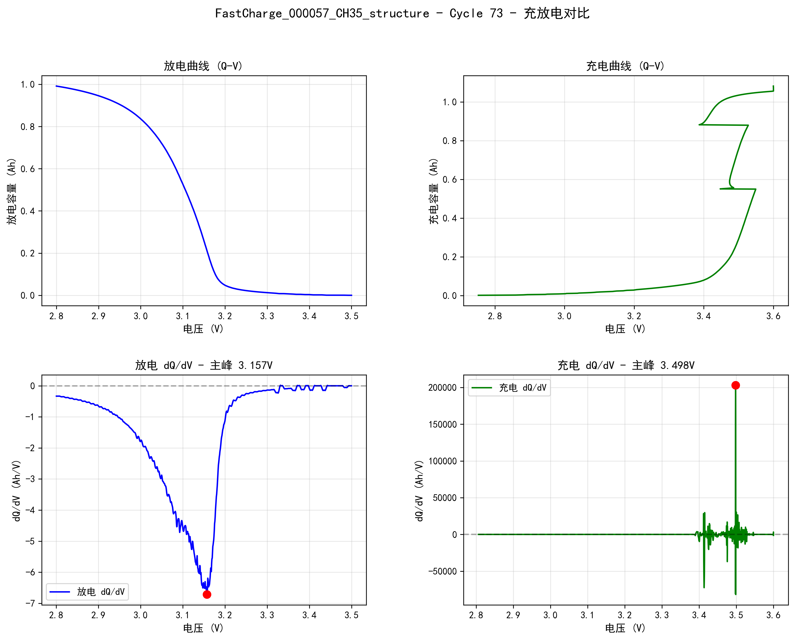

# 锂电池循环寿命预测

**状态**：🚧 更新中


## 数据来源

**论文**：*Data-driven prediction of battery cycle life before capacity degradation*  
**作者**：Severson et al.  
**期刊**：Nature Energy, 2019

---

## 数据集概况

| 项目 | 数值 |
|------|------|
| 文件数 | 140 个 JSON（140颗电池） |
| 总大小 | 26.03 GB |
| 平均每文件 | 190 MB |
| 循环次数要求 | ≥ 100（筛选后约120颗） |

---

## 数据结构

作者使用 BEEP 工具将原始 Arbin 数据转为结构化 JSON：

```json
{
  "@module": "beep.structure",
  "@class": "ProcessedCyclerRun",
  "barcode": "电池序列号",
  "protocol": "充电策略名称",
  "summary": { ... },              // 循环级汇总数据
  "cycles_interpolated": { ... }  // 详细时序数据（按step_type分块存储）
}
```

**重要发现**：`cycles_interpolated` 按 step_type 分成两大块：
- 前半段：所有循环的 discharge
- 后半段：所有循环的 charge

---

## 特征工程

### ΔQ(V) 差分容量曲线

```
ΔQ(V) = Q₁₀₀(V) - Q₁₀(V)
```

### 统计特征（9个）

| 特征 | 物理意义 |
|------|----------|
| dQ_variance | 容量变化不均匀性 |
| dQ_minimum | 最大局部退化 |
| dQ_maximum | 最大局部增益 |
| dQ_mean | 平均容量变化 |
| dQ_skewness | 退化模式对称性 |
| dQ_kurtosis | 退化模式尖锐程度 |
| dQ_range | 变化幅度 |
| dQ_abs_mean | 绝对变化量 |
| dQ_std | 变化标准差 |

### 汇总特征（6个）

| 特征 | 来源 |
|------|------|
| temp_max | 最高温度 |
| temp_avg | 平均温度 |
| resistance | 内阻 |
| charge_time | 充电时长 |
| capacity_fade_100 | 前100循环容量衰减 |
| capacity_ratio_100_2 | 容量保持率 |

---

## 模型训练

### Elastic Net 回归

```python
GridSearchCV(
    ElasticNet(max_iter=10000),
    {'alpha': [0.001, 0.01, 0.1, 1.0],
     'l1_ratio': [0.1, 0.3, 0.5, 0.7, 0.9]},
    cv=5
)
```

**最优参数**：α=0.1, l1_ratio=0.3

---

## 结果

| 指标 | 值 |
|------|-----|
| **MAPE** | 15.15% |
| **RMSE** | 154.9 cycles |
| **R²** | 0.70 |

### 完整模型方程

```
log(寿命) = 6.491553
          - 0.097189 × capacity_fade_100_scaled
          + 0.077163 × dQ_minimum_scaled
          - 0.073411 × dQ_std_scaled
          + 0.071857 × dQ_mean_scaled
          - 0.068692 × dQ_abs_mean_scaled
          - 0.039759 × dQ_range_scaled
          - 0.025998 × resistance_scaled
          + 0.012878 × dQ_maximum_scaled
```

---

## 不确定性量化

### Gaussian Process

| 指标 | 值 |
|------|-----|
| 95% Coverage | 92.9% |
| 校准误差 | 2.1% |

---

## 关键发现

### 1. 最重要特征

`capacity_fade_100`（前100循环容量衰减）是最重要特征，与工程直觉高度吻合。

### 2. 异常样品

| 真实值 | 预测值 | 误差 |
|--------|--------|------|
| 538 | 1185 | 120% ❌ |

这颗电池"体检"时表现健康，但在后期发生突然衰减，可能存在未知的衰减机理（锂析出？微短路？），值得深入研究。

---

## 可视化



---

## 待优化

- [ ] 按批次划分数据（论文方法）以降低 MAPE
- [ ] 尝试 Conformal Prediction 缩小置信区间
- [ ] 对齐论文的 EOL 定义（80% 额定容量）
