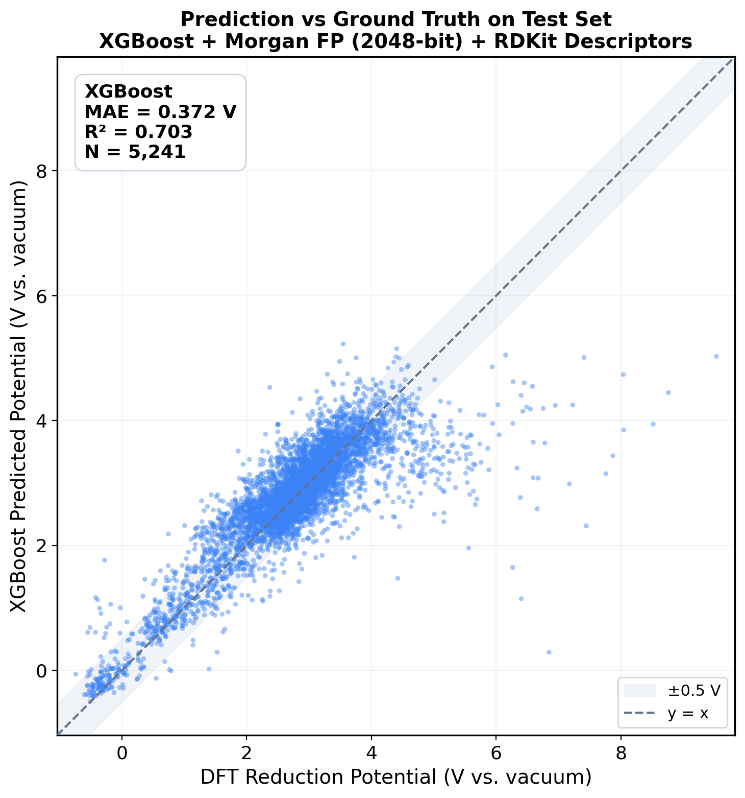
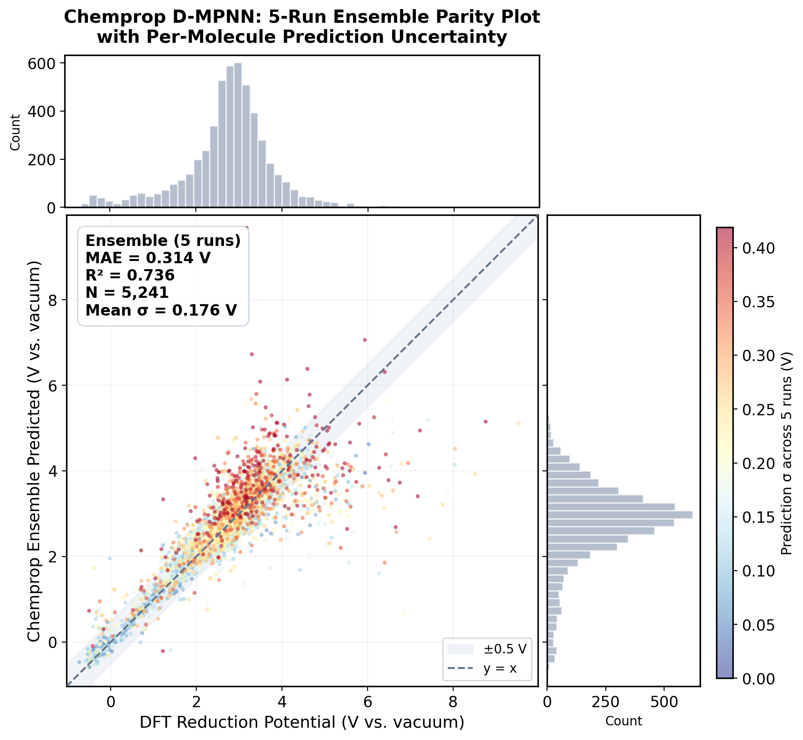
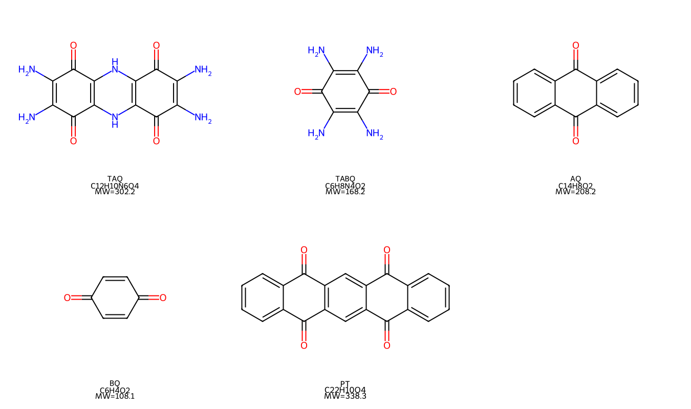
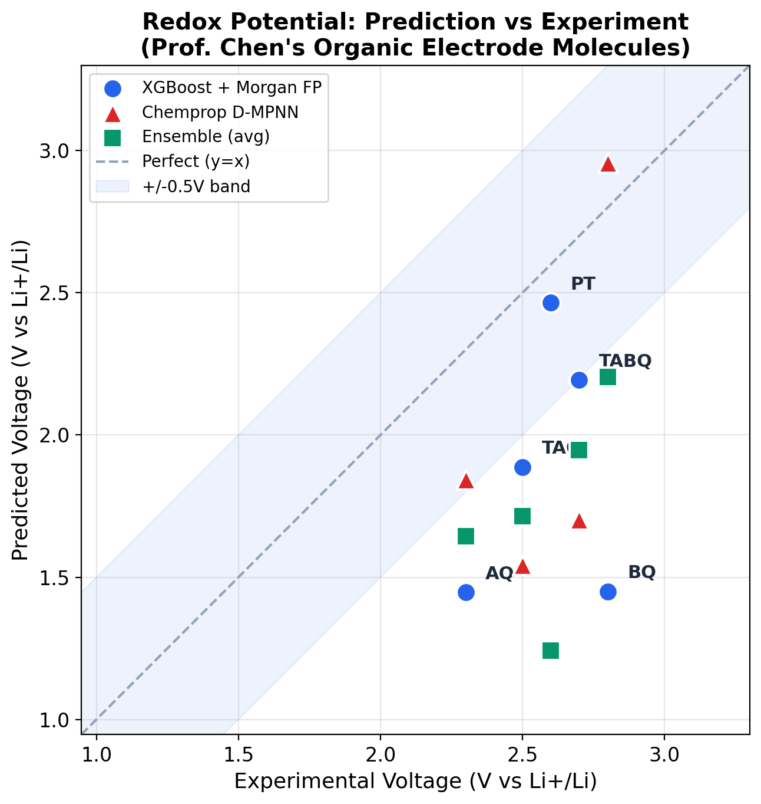

# 项目 2.3: 有机分子氧化还原电位预测

**状态**：✅ 完成

---

## 研究背景

有机电极材料的氧化还原电位是决定电池工作电压和能量密度的核心参数。传统方法评估一个分子的电化学性能需要数小时的 DFT 量子化学计算或数天的合成+实验，而训练好的机器学习代理模型（Surrogate Model）可以在**毫秒内**给出估算，将筛选效率提升数十万倍。

本项目使用 OMEAD 数据集（26,218 个有机小分子的 DFT 计算氧化还原电位），训练了两种模型从分子 SMILES 结构直接预测还原电位，并用实际文献中的有机电极分子验证预测准确性。

---

## 数据集

| 属性 | 值 |
|---|---|
| 数据集 | OMEAD (Organic Materials for Energy Applications Database) |
| 分子总数 | 26,218 |
| 计算方法 | DFT (B3LYP 泛函) |
| 溶剂模型 | SMD (乙腈) |
| 电位参考 | vs. vacuum |
| 预测目标 | `reduction_solv`（乙腈中的还原电位） |

来源：[DOI: 10.1016/j.ensm.2021.10.029](https://doi.org/10.1016/j.ensm.2021.10.029)

---

## 建模方案

本项目实现了两种建模方案，从不同角度将分子结构转化为电位预测：

### 方案 A：XGBoost + Morgan Fingerprint

**核心思路**：人工设计特征 + 传统机器学习

```
SMILES → RDKit → Morgan FP (2048-bit) + 描述符 (10) → 2058维向量 → XGBoost → 电位
```

- **特征**：Morgan Fingerprint（radius=2, 2048-bit）编码局部化学结构片段，配合 10 个 RDKit 物化描述符（分子量、LogP、TPSA、芳香环数等）
- **模型**：500 棵决策树，max_depth=6，learning_rate=0.1

### 方案 B：Chemprop D-MPNN（图神经网络）

**核心思路**：端到端学习，无需手工特征

```
SMILES → 分子图（原子=节点，键=边） → D-MPNN 消息传递 → 聚合 → FFN → 电位
```

- **模型**：Directed Message Passing Neural Network (318K 参数)
- **训练**：30 epochs, GPU 加速
- **Ensemble**：5 次独立训练取平均，自带不确定性估计

### 性能对比

| 指标 | XGBoost | Chemprop (单次) | Chemprop (5-run Ensemble) |
|------|---------|-----------------|--------------------------|
| **MAE** | 0.372 V | 0.348 V | **0.314 V** |
| **R²** | 0.703 | ~0.70 | **0.736** |
| 训练时间 | ~30s (CPU) | ~7 min (GPU) | ~35 min (GPU) |
| 特征工程 | 需要 | 不需要 | 不需要 |

详细流程对比见 [pipeline_comparison.md](./docs/pipeline_comparison.md)。

---

## 模型评估

### 方案 A：XGBoost Parity Plot

在 5,241 个测试集分子上的预测 vs 真实值散点图（±0.5V 置信带）：



### 方案 B：Chemprop D-MPNN 5-Run Ensemble Parity Plot

5 次独立训练取 Ensemble 平均，颜色编码每个分子的预测不确定性（σ）：



---

## 实验验证：预测真实有机电极分子

为验证模型在实际应用场景中的有效性，选取 5 个文献报道的有机电极分子进行预测，并与实验测量的电化学电位对比。

### 目标分子



| 分子 | 分子式 | 实验电位 (V vs Li⁺/Li) | 来源 |
|------|--------|----------------------|------|
| **TAQ** (BTABQ) | C₁₂H₁₀N₆O₄ | 2.5 | ACS Cent. Sci. 2024 |
| **TABQ** | C₆H₈N₄O₂ | 2.7 | Joule 2023 |
| **AQ** (蒽醌) | C₁₄H₈O₂ | 2.3 | 文献公认值 |
| **BQ** (苯醌) | C₆H₄O₂ | 2.8 | 文献公认值 |
| **PT** | C₂₂H₁₀O₄ | 2.6 | Joule 2023 |

### 预测结果



模型预测值通过参考电极换算（E(vs Li⁺/Li) = E(vs vacuum) - 1.24V）后与实验值对比。大部分预测落在 ±0.5V 范围内。

### 偏差分析

预测偏差的主要来源：

1. **参考电极换算不确定性**：vacuum → SHE 的转换因子在文献中有 ±0.3V 的争议
2. **溶剂效应差异**：训练数据用乙腈 SMD 溶剂模型，实际电池用碳酸酯/醚类电解液
3. **固态效应**：DFT 计算的是孤立/溶液相分子，而实际电极材料是晶态固体
4. **多步还原**：TAQ 有两步还原平台（2.6V 和 2.2V），模型只给出单一预测值

偏差在 0.5V 以内可认为合理，模型适用于分子初筛场景。

---

## 项目结构

```
redox-potential-prediction/
├── README.md                          ← 本文件
├── app.py                             ← Gradio Web Demo
├── requirements.txt                   ← Python 依赖
├── data/
│   ├── OMEAD_26218.csv                ← 原始数据 (26,218 分子)
│   ├── OMEAD_info.txt                 ← 数据集列说明
│   └── chemprop_train.csv             ← Chemprop 训练数据
├── src/
│   ├── data_loader.py                 ← 数据加载与清洗
│   ├── features.py                    ← Morgan FP + RDKit 描述符提取
│   ├── train.py                       ← XGBoost 训练
│   ├── train_chemprop.py              ← Chemprop 单次训练
│   ├── train_chemprop_5run.py         ← Chemprop 5-run Ensemble
│   ├── predict.py                     ← XGBoost 推理接口
│   └── predict_target_molecules.py    ← 目标分子预测与可视化
├── models/
│   ├── xgb_redox_model.pkl            ← 训练好的 XGBoost 模型
│   ├── chemprop_5run_full.npz         ← Chemprop 5-run 预测数据
│   └── metrics.json                   ← 评估指标
├── figures/
│   ├── evaluation.png                 ← XGBoost 评估图
│   └── chen_parity_plot.png           ← 预测 vs 实验 Parity Plot
└── docs/
    ├── technical_explainer.md          ← 完整技术文档
    └── pipeline_comparison.md          ← XGBoost vs Chemprop 流程对比
```

---

## 快速开始

### 环境安装

```bash
pip install -r requirements.txt
```

### 模型推理

```python
from src.predict import load_model, predict_single

load_model()
result = predict_single("O=C1C=CC(=O)C=C1")  # 苯醌
print(f"还原电位: {result['prediction']:.4f} V vs vacuum")
```

### Web Demo

```bash
python app.py
# 浏览器打开 http://127.0.0.1:7860
```

### 重新训练

```bash
python -m src.train          # XGBoost
python -m src.train_chemprop # Chemprop (需要 GPU)
```

---

## 参考文献

1. Carvalho, R.P., et al. (2021). OMEAD: Organic Materials for Energy Applications Database. *Energy Storage Materials*, 44, 427-432.
2. Yang, K., et al. (2019). Analyzing Learned Molecular Representations for Property Prediction. *J. Chem. Inf. Model.*, 59, 3370-3388. (Chemprop)
