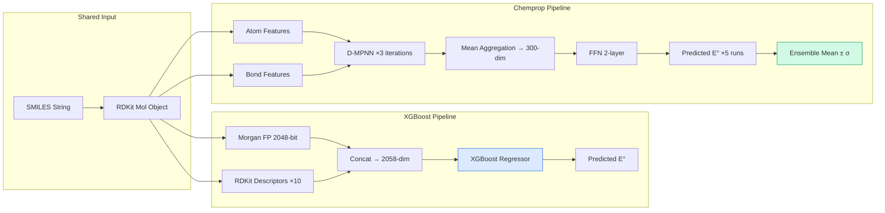

# XGBoost vs Chemprop D-MPNN: Pipeline Comparison

This document describes the complete data flow of the two modeling approaches used in this project to predict molecular reduction potentials from the OMEAD dataset.

---

## Shared Foundation

Both pipelines start from the **same input** and target the **same output**:

| Item | Detail |
|---|---|
| **Input** | SMILES string (1D molecular notation) |
| **Target** | Reduction potential in acetonitrile solvent (V vs. vacuum), from DFT calculation |
| **Dataset** | OMEAD — 26,218 organic molecules with DFT-computed redox potentials |
| **Split** | 80/20 train/test, `random_state=42`, `train_test_split` from scikit-learn |
| **Train set** | ~20,964 molecules |
| **Test set** | ~5,241 molecules |

---

## Pipeline A: XGBoost

```
SMILES ──→ RDKit Mol ──→ Feature Extraction ──→ XGBoost ──→ Potential (V)
                              │
                    ┌─────────┴──────────┐
              Morgan FP (2048)    RDKit Descriptors (10)
                    └─────────┬──────────┘
                         Concat → 2058-dim vector
```

### Step 1: SMILES → RDKit Mol Object

```python
mol = Chem.MolFromSmiles(smiles)  # rdkit.Chem
```
- Parse the SMILES string into an internal molecular graph representation
- Invalid SMILES are filtered out (returns `None`)

### Step 2: Feature Extraction (Manual)

This is the key differentiator — XGBoost cannot read molecular graphs directly, so we must manually convert them to fixed-length numerical vectors.

#### 2a. Morgan Fingerprint (2048-bit)

```python
fp = AllChem.GetMorganFingerprintAsBitVect(mol, radius=2, nBits=2048)
```
- Enumerates circular substructures around each atom up to radius 2
- Hashes each substructure into one of 2048 binary bits
- Result: a **2048-dimensional binary vector** (each bit = 0 or 1)
- Captures: what types of local chemical fragments exist in the molecule
- **Cannot** capture: 3D geometry, global topology, or distinguish certain isomers

#### 2b. RDKit Physicochemical Descriptors (10)

```python
descriptors = {
    "MolWt":            Descriptors.MolWt(mol),            # Molecular weight
    "LogP":             Descriptors.MolLogP(mol),           # Octanol-water partition
    "TPSA":             Descriptors.TPSA(mol),              # Topological polar surface area
    "NumHDonors":       Descriptors.NumHDonors(mol),        # H-bond donors
    "NumHAcceptors":    Descriptors.NumHAcceptors(mol),     # H-bond acceptors
    "NumRotatableBonds":Descriptors.NumRotatableBonds(mol), # Rotatable bond count
    "NumAromaticRings": CalcNumAromaticRings(mol),          # Aromatic ring count
    "NumHeavyAtoms":    Descriptors.HeavyAtomCount(mol),    # Non-H atom count
    "RingCount":        Descriptors.RingCount(mol),         # Total ring count
    "FractionCSP3":     Descriptors.FractionCSP3(mol),      # sp3 carbon fraction
}
```
- 10 scalar values computed from the molecular graph
- These are "global" descriptors, each one summarizes an entire molecule into a single number

#### 2c. Concatenation

```python
X = np.concatenate([fp, np.array(list(descriptors.values()))])  # shape: (2058,)
```
- Final feature vector: **2058 dimensions** (2048 fingerprint bits + 10 descriptors)

### Step 3: Model Training

```python
model = XGBRegressor(
    n_estimators=500,     # 500 boosting rounds
    max_depth=6,          # tree depth limit
    learning_rate=0.1,    # learning rate
    subsample=0.8,        # row sampling
    colsample_bytree=0.8, # column sampling
    random_state=42,      # deterministic
)
model.fit(X_train, y_train)
```
- Gradient-boosted decision tree ensemble
- **Deterministic**: same data + same seed = same model every time
- Model saved as: `models/xgb_redox_model.pkl` (via joblib)

### Step 4: Prediction

```python
y_pred = model.predict(X_new)  # X_new shape: (n_molecules, 2058)
```
- Input: 2058-dim feature vector(s)
- Output: predicted reduction potential(s) in V vs. vacuum
- **Deterministic**: same input features always produce the same prediction

### Results

| Metric | Value |
|---|---|
| Test MAE | 0.372 V |
| Test R² | 0.703 |
| Prediction latency | < 1 ms per molecule |

---

## Pipeline B: Chemprop D-MPNN

```
SMILES ──→ Molecular Graph ──→ Message Passing ──→ Aggregation ──→ FFN ──→ Potential (V)
               (atoms + bonds)       (learned)        (mean pool)     (learned)
```

### Step 1: SMILES → Molecular Graph (Automatic)

```python
mol = Chem.MolFromSmiles(smiles)
datapoint = MoleculeDatapoint(mol)
```
- Chemprop converts the RDKit mol into an **attributed graph**:
  - **Nodes** = atoms, with features: atomic number, degree, formal charge, hybridization, aromaticity, etc.
  - **Edges** = bonds, with features: bond type (single/double/triple/aromatic), conjugation, ring membership, stereo
- **No manual feature engineering** — the graph IS the input

### Step 2: Directed Message Passing Neural Network (D-MPNN)

```python
message_passing = chemprop_nn.BondMessagePassing()
```

This is where the core computation happens, in 3 iterative steps:

#### 2a. Message Initialization

- Each directed bond (edge) gets an initial hidden vector based on atom and bond features
- For a molecule with `n` bonds, there are `2n` directed messages (one per direction)

#### 2b. Message Passing (T iterations, default T=3)

At each iteration t:
```
m_t(v→w) = Σ_{u∈N(v)\{w}} W_t · m_{t-1}(u→v)
```
- Each directed edge message is updated by aggregating incoming messages from neighbor edges
- This is "directed" because messages coming FROM w are excluded when updating the v→w message (to prevent information echo)
- `W_t` is a **learned weight matrix** (this is what the neural network learns during training)
- After T iterations, each bond's message encodes information from its **T-hop neighborhood**

#### 2c. Atom Representation

```
h(v) = τ(W · [x_v, Σ_{w∈N(v)} m_T(w→v)])
```
- For each atom v, aggregate all final incoming messages and combine with the atom's own features
- `τ` is a nonlinear activation (ReLU)
- Result: one hidden vector per atom that encodes both **local chemistry and graph context**

### Step 3: Readout (Aggregation)

```python
agg = chemprop_nn.MeanAggregation()
```
```
h_mol = (1/n) Σ_v h(v)
```
- Average all atom hidden vectors into a **single fixed-length molecule vector** (300-dim)
- This step is analogous to generating the "fingerprint" in the XGBoost pipeline, but here it's **learned** rather than hand-crafted

### Step 4: Feed-Forward Network (FFN) → Prediction

```python
predictor = chemprop_nn.RegressionFFN()
```
```
ŷ = FFN(h_mol) = W₂ · ReLU(W₁ · h_mol + b₁) + b₂
```
- Two-layer fully connected network
- Maps the 300-dim molecule vector to a scalar output (predicted potential)

### Step 5: Training

```python
trainer = pl.Trainer(max_epochs=30, accelerator="gpu")
trainer.fit(model, train_loader)
```
- Loss function: MSE
- Optimizer: Adam
- Total parameters: ~318K (227K message passing + 91K FFN)
- **Non-deterministic**: random weight initialization → different model each run
- To address this: we train 5 independent models and ensemble their predictions

### Step 6: Ensemble Prediction

```python
ensemble_pred = mean(run1_pred, run2_pred, run3_pred, run4_pred, run5_pred)
pred_uncertainty = std(run1_pred, ..., run5_pred)
```
- Average 5 models' predictions → reduces variance, improves accuracy
- Standard deviation across 5 runs → built-in uncertainty estimate per molecule

### Results

| Metric | Single Run (avg) | 5-Run Ensemble |
|---|---|---|
| Test MAE | 0.352 ± 0.003 V | **0.314 V** |
| Test R² | ~0.70 | **0.736** |
| Training time | ~7 min/run (GTX 1650) | ~35 min total |
| Prediction latency | ~10 ms per molecule | ~50 ms (5 models) |

---

## Side-by-Side Comparison

| Aspect | XGBoost | Chemprop D-MPNN |
|---|---|---|
| **Input representation** | Fixed 2058-dim vector (manual) | Molecular graph (automatic) |
| **Feature engineering** | Required (Morgan FP + descriptors) | Not needed (features are learned) |
| **Model type** | Gradient-boosted trees | Graph neural network |
| **Parameters** | ~500 trees × ~63 leaves | ~318K learnable weights |
| **Determinism** | ✅ Deterministic | ❌ Non-deterministic (random init) |
| **Ensemble needed?** | No (single model sufficient) | Yes (5 runs recommended) |
| **Test MAE** | 0.372 V | 0.314 V (ensemble) |
| **Test R²** | 0.703 | 0.736 (ensemble) |
| **Training time** | ~30 seconds | ~35 minutes (5 runs) |
| **GPU required?** | No | Yes (strongly recommended) |
| **Isomer discrimination** | ❌ Poor (hashing collisions) | ✅ Better (graph-aware) |
| **Interpretability** | ✅ Feature importance available | ❌ Black box |
| **Deployment** | Simple (`.pkl` file, ~5MB) | Complex (PyTorch + RDKit) |
| **OOD uncertainty** | None (single point estimate) | Built-in (σ across runs) |

---

## Information Flow Diagram



---

## Key Takeaway

The fundamental difference is **where intelligence lives**:

- **XGBoost**: Intelligence is in the **feature engineering** — the researcher decides what molecular properties matter (fingerprints, descriptors), and the model learns how to combine them
- **Chemprop**: Intelligence is in the **model itself** — the network learns both what features to extract AND how to combine them, directly from molecular graphs

This explains why Chemprop achieves lower MAE (0.314 vs 0.372 V): it can discover molecular representations that manual feature engineering might miss. The trade-off is non-determinism and higher computational cost.
